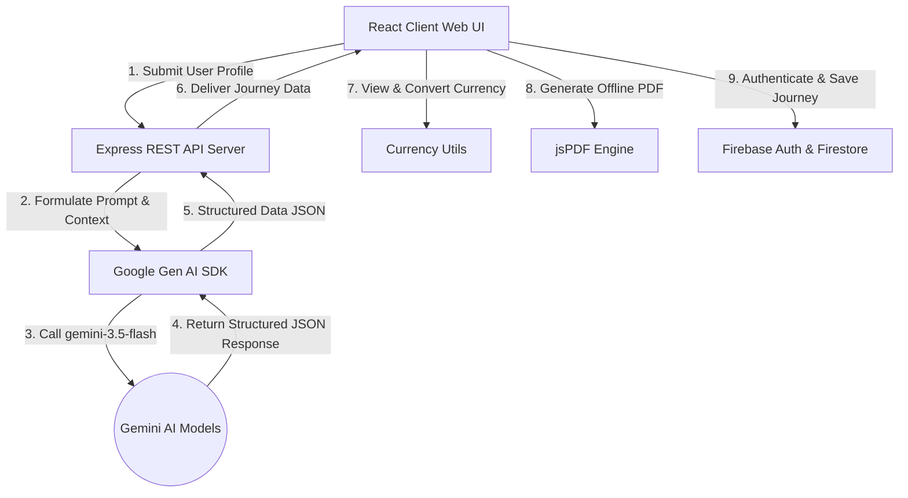

<h1>🗺️ Roamora Elite Planner</h1>
  <p><strong>Deep Immersion, Local Lore & Heritage Journeys Powered by Gemini 3.5 Flash</strong></p>

  <p>
    
    
    
    
    
    
  </p>

  <h4>
    <a href="#-key-features">Key Features</a> • 
    <a href="#-architecture">Architecture</a> • 
    <a href="#%EF%B8%8F-tech-stack">Tech Stack</a> • 
    <a href="#%EF%B8%8F-getting-started">Getting Started</a> • 
    <a href="#-file-structure">File Structure</a>
  </h4>
</div>

---

> [!NOTE]  
> **Roamora** rejects the ordinary "checkbox" style of tourism. Instead, it synthesizes deeply local itineraries, rich cultural storytelling, traditional table etiquette, sustainable accommodation alternatives, offline gamified missions, and emergency phrasebooks to transform casual travel into a true heritage pilgrimage.

---

## ✨ Key Features

Roamora implements a highly structured, 15-step generator workflow to build comprehensive, hyper-personalized travel dossiers:

| Feature | Description |
| :--- | :--- |
| **🗺️ Story-Rich Itineraries** | Hourly-segmented schedules complete with local legends, crowd ratings, difficulty levels, and accessibility profiles. |
| **🍲 Heritage Gastronomy** | Traditional food and beverage guides mapping historic ingredients, best locations, and local dining etiquette. |
| **💎 Locals-Only Hidden Gems** | Off-the-beaten-path sites complete with their mythologies and folkloric tales. |
| **🏅 Gamified Cultural Missions** | Fun, offline challenges (such as practicing dialects or visiting local artisans) that reward travelers with virtual badges. |
| **🏨 Conscious Accommodations** | Heritage stays, homestays, eco-lodges, and local inns aligned with neighborhood conservation. |
| **🎭 Etiquette & Phrasebooks** | Do's and Don'ts, dress codes, conversational greetings in native scripts, and situational advice. |
| **💵 Dynamic Budget Planner** | Tailored cost breakdowns with interactive multi-currency conversion (USD/Local/Preferred). |
| **📄 Offline PDF Dossiers** | Beautifully formatted, multi-page vector travel chronicles generated entirely client-side using `jsPDF`. |
| **🔐 Explorer Atlas Sync** | User login and persistence via Firebase Auth & Firestore to save generated journeys across devices. |

---

## 🏛️ Architecture

Roamora uses a full-stack architecture combining a robust Express server with a high-performance React front-end powered by Vite:



---

## 🛠️ Tech Stack

### Frontend
- **React 19** & **TypeScript** — Component architecture with modern hooks.
- **Tailwind CSS v4** — Premium styling with dynamic themes.
- **Motion (framer-motion)** — Micro-interactions, slide transitions, and animations.
- **Lucide React** — High-quality vector iconography.
- **jsPDF** — Dynamic PDF document synthesis with page auto-wrapping and currency mapping.

### Backend
- **Express.js** & **tsx** — Clean REST API endpoints and asset routing.
- **@google/genai SDK** — Native, structured JSON schema response extraction from Google's flagship models.
- **dotenv** — Secure localized environment configuration.

---

## ⚙️ Getting Started

### Prerequisites
- **Node.js** (v18 or higher recommended)
- **npm** or **yarn**
- **Google Gemini API Key** (Get one at [Google AI Studio](https://aistudio.google.com/))
- **Firebase Project Credentials** (For user accounts & itinerary saving)

### Local Installation

1. **Clone the project & install dependencies:**
   ```bash
   npm install
   ```

2. **Configure your Environment:**
   Create a `.env` file in the root directory (you can copy `.env.example` as a starting point) and add your keys:
   ```env
   GEMINI_API_KEY=your_gemini_api_key_here
   PORT=3000
   ```
   Configure your Firebase credentials in `firebase-applet-config.json` or configure it inside `src/lib/firebase.ts`.

3. **Launch the Development Server:**
   ```bash
   npm run dev
   ```
   *The server will start at `http://localhost:3000` with the Vite dev middleware automatically serving the React app.*

### Build & Deploy

- **Create a Production Bundle:**
   ```bash
   npm run build
   ```
   *This compiles the Vite frontend into `/dist` and bundles the TypeScript backend server using esbuild into `dist/server.cjs`.*

- **Launch Production Server:**
   ```bash
   npm run start
   ```

---

## 📂 File Structure

```text
Roamora/
├── src/
│   ├── components/         # UI Elements (Form, Guides, Modals, etc.)
│   │   ├── TravelForm.tsx          # Comprehensive inputs & preferences
│   │   ├── ItineraryView.tsx       # Timeline layout with storyteller lore
│   │   ├── FoodGuide.tsx           # Gastronomy cards & custom etiquette
│   │   ├── BudgetPlanner.tsx       # Segmented budgets & currency switches
│   │   ├── AuthModal.tsx           # Firebase Auth modal
│   │   ├── SavedJourneys.tsx       # Saved Atlas inspector
│   │   └── ...
│   ├── lib/
│   │   └── firebase.ts     # Firebase auth & database initializer
│   ├── utils/
│   │   ├── pdfGenerator.ts # jsPDF report layout builder
│   │   └── currency.ts     # Multi-currency translation logic
│   ├── types.ts            # Strict TypeScript models of response schemas
│   ├── App.tsx             # Main dashboard shell & state manager
│   └── main.tsx            # App bootstrap entry
├── server.ts               # Express.js REST API + Gemini SDK router
├── vite.config.ts          # Vite build config
├── tailwind.config.js      # Styling utilities
├── package.json            # Node project configuration
└── firestore.rules         # Database security policies
```

---

## 📜 Curation Guidelines & Coded Philosophies

Roamora is programmed with specific constraints to guarantee high-integrity plans:
1. **Accessibility and Limitations:** Physical parameters (`physicalLimitations` and `accessibilityRequirements`) are strictly respected inside the itinerary.
2. **Pacing Philosophy:** Avoids packed tourist rushes. Features alternatives for every activity in case of overcrowding or closures.
3. **No Placeholders:** All content is generated fully customized to the user's specific duration (exactly matching the requested days) and dietary choices.
